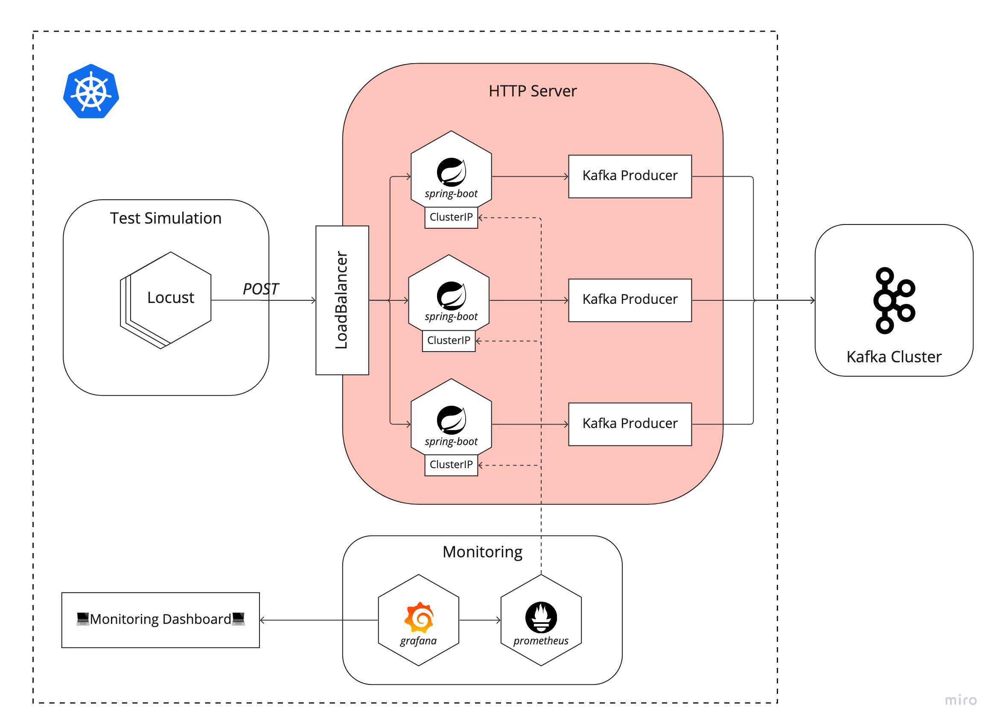

# Publish application for physiologycal sensor data

This project is for stream application in distributed real-time data processing system. The overall architecture is as follows:

* The red colored area is managed in this project.
* If you interested in [consumer application](https://github.com/goomon/spring-kafka-sbuscriber) or [simulation application](https://github.com/goomon/kafka-locust) part, feel free to visit.

## Congifuration

